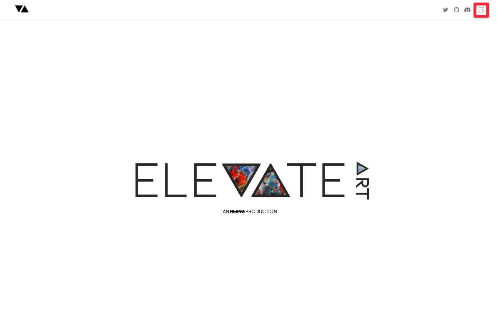
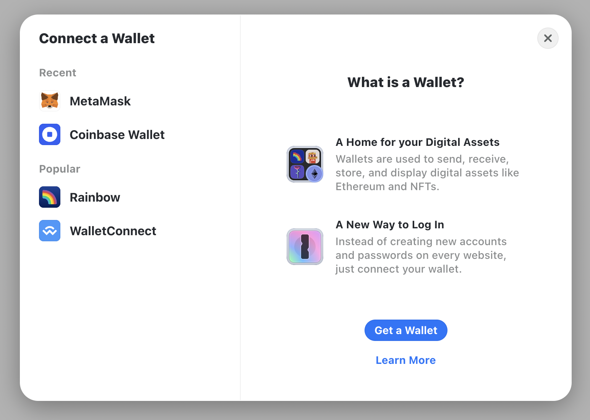
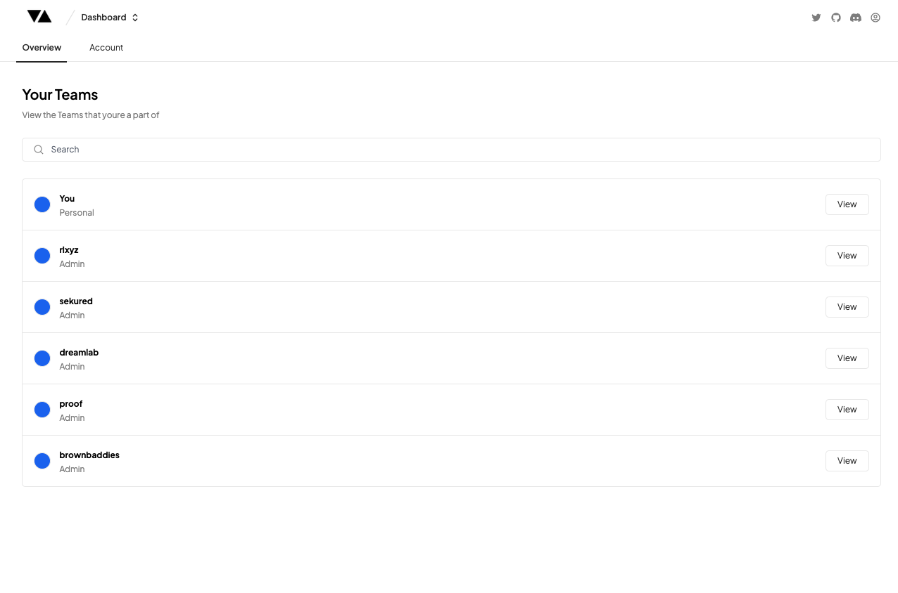

# Creating Your Account & Teams

---

### Connecting Your Wallet

Creating an Elevate Art account is super simple! Simply 'Sign Up' or 'Log In' by clicking on the Wallet in the top right hand corner.

You can use a MetaMask (recommended), Coinbase, Rainbow or WalletConnect supported wallet to log in. Click on your wallet of choice, then follow the prompts in the modal to connect your wallet to Elevate Art.

:::note
For Web3 it is standard practice to ‘Sign in’ using your Web3 Wallet as the primary authentication method for privacy as well as security.

The transaction that pops up to ‘Sign In’ is a _gasless_ (i.e. free) transaction which means you do not need any ETH in your wallet to complete this transaction. The _signing_ transaction is like a username/password log in that is there to confirm that you are the owner of that wallet.
:::

If you experience trouble logging in, double check to make sure you’ve downloaded any browser extensions required to connect, and if you have a popup blocker, make sure it is disabled for elevate.art.

---

### Create Your Team

Once you have logged in, you will land on your Dashboard page which has your own peronal Team already set up.

Teams are where you create your Projects which house your Collections.

For example, PROOF Holdings (the Team), would have Moonbirds & Oddities (as Projects), which would house multiple versions of the Collections which they are modifying and curating.

Congratulations! Now you have your first Team you can create your first Project by [uploading your art](./generator/upload-art)
