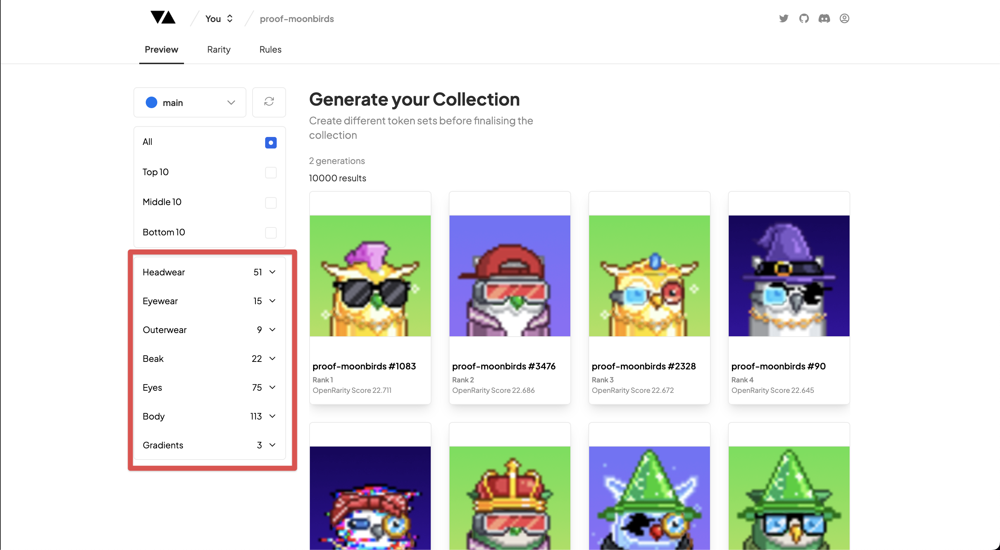
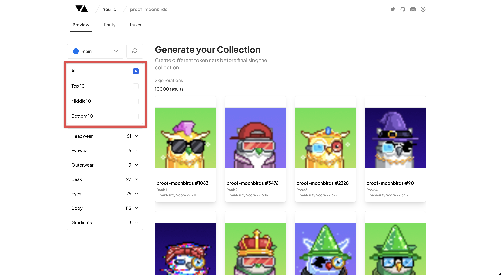

# Filters

---

### Filter by Trait

Filters provide a quick and easy way to see a smaller subset of your collection in terms of rarity or traits to see how well distributed your Collection is for your collectors.

The filter system is very flexible and allows you to filter by multiple traits at once. For example, you can filter by a single or multiple traits, and you can also filter with single or multiple traits and a rarity filter.

The filter system is displayed using your Layers and Trait hierarchy as it would be in the leading market places and will display the number of times the specific trait is found in your Collection.

### Filter by Rarity

As a collector one of the key quality filters that will be used over a collection is not just how good the art at the top tier of rarity but also at the 'floor' (bottom) rarity.

If you have a collection that is visually indistinguishable from the most rare to the least rare, then all things being equal, it will not be as valuable.

To make it easier for you to view this at a glance we have created a filter to give you the ability to filter by the Top, Middle, and Bottom 10 pieces in terms of rarity. This is a great way to get a quick sense check for how the overall look of the entire collection will be.
