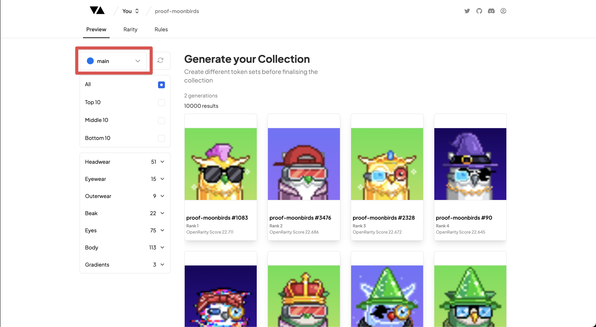

# Collections

---

### View Your Collections

Once you have successfully uploaded your art layers the Generator will automatically create a new Collection for you in the Preview tab. Here you'll have the ability to scroll through your entire collection quickly and easily.

:::note
When you first Upload your Trait Artwork for the first time you may notice that the layers are out of order. To re-arrange your layers you need to first Reorder your Layers by heading to the [Layers](./layers) tab.
:::

The collection size will automatically default to 10,000 pieces and you will have the ability to change this in the drop down menu highlighted above. This is your **Collections** section where you have the ability to create as many **new** branches of your project with different collection sizes.

Each collection you create will be completely unique from the **main** branch which is automatically created and you can create as many different generations of your collection within your new branch.
