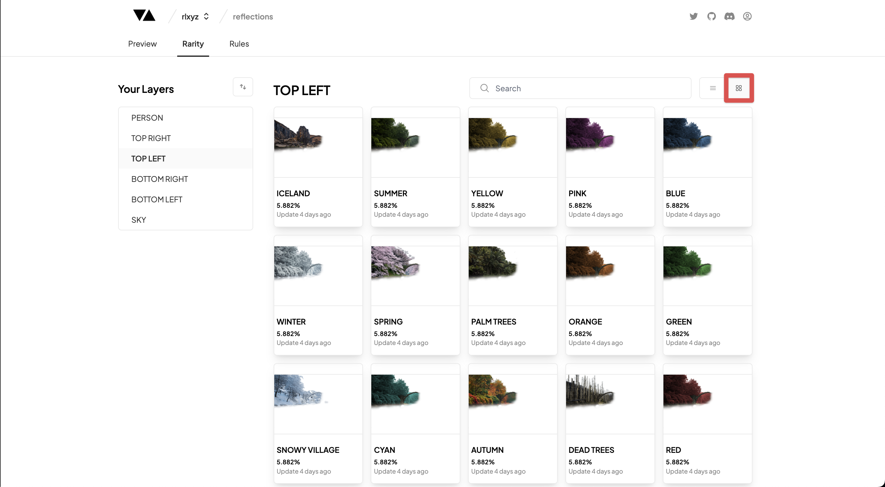

# Trait Image View

---

### Trait Image View

The Trait Image View table is where you can take a quick view of all the images for your Traits within your Layers.

You can navigate to this page by clicking on the Img view button highlighted in the image above.

### Search

You can search the Traits in your Layers by entering your search term into the Search bar at the top of the Rarity Table.

### Coming Soon

- Adding Traits
- Deleting Traits
