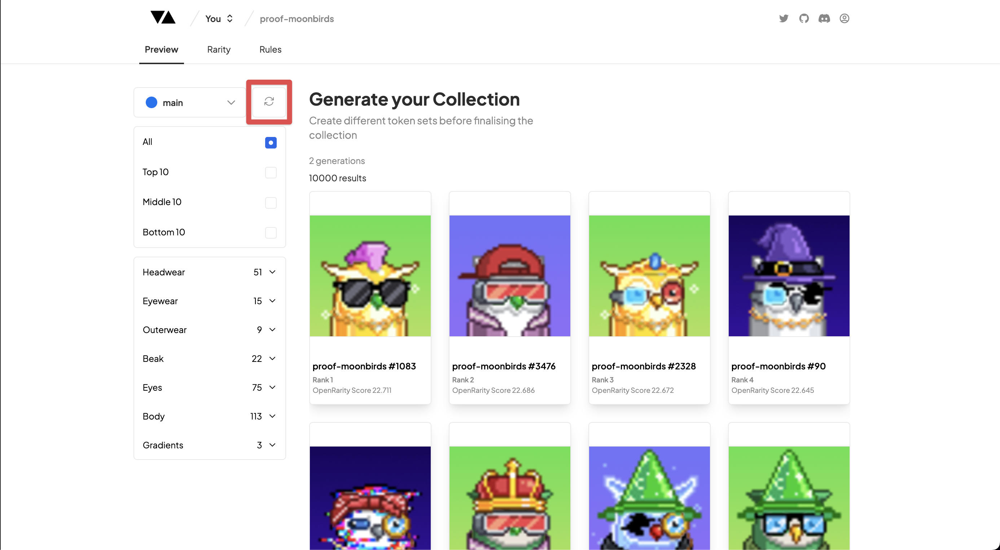

# Re-generate Collection

---

### Re-generate in 1 Click

One of the key features of the Elevate Art Generator is the ability to re-generate new Collections in (milli)seconds!

We want to encourage you to create as many Collections as you like and we have ensured that it is **as fast as possible, and at no cost**.

To Re-generate your existing collection you just need to click on the 'Re-generate' button highlighted in the image above.

You will be able to view how many unique generations you've done of your collection at the top of your Collection preview.

### Coming Soon

- Ability to 'Re-Roll' each individual token on its own in the Preview tab
