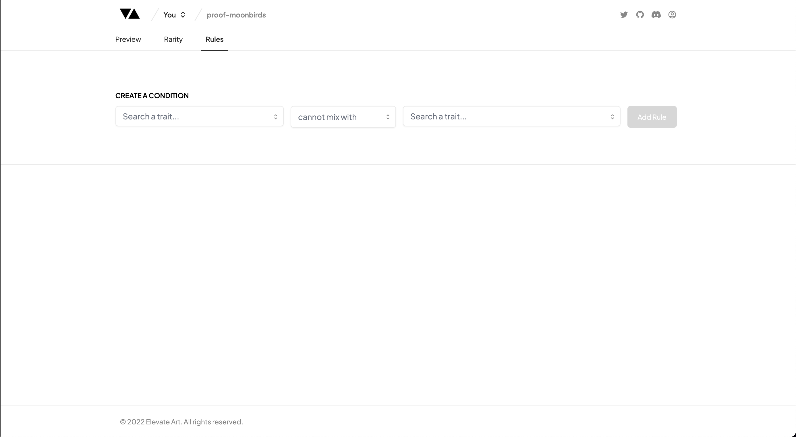
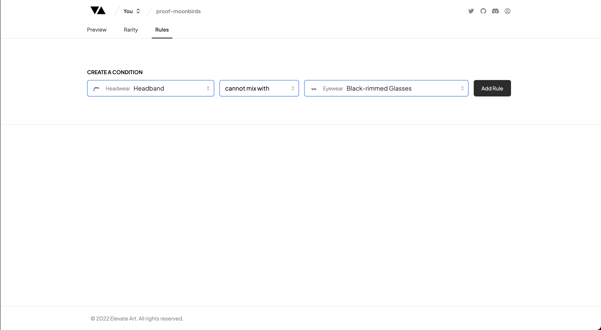
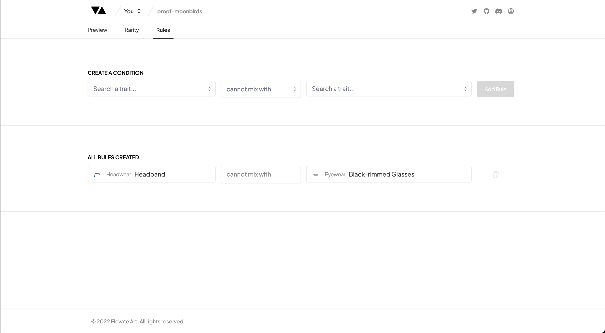

# Rules

---

### Rules Table

The Rules tab is where you can define special rules on how a Trait will pair (or not) with another set of Traits.

All the rules which you create in this section are bi-directional, which means that when you apply a rule to a Trait in one Layer, it will also apply within the other Layer.

### Creating a New Rule

Firstly, to add a new Rule simply Select a Trait from the first Column by typing the name of the Trait or clicking on a Trait from the dropdown list.

Secondly, choose the Rule Type from the second column.

You have several different options for Rules which you can apply to a Trait such as:

• 'Cannot Mix With'  
• 'Only Mixes With'  
• 'Always Pairs With'

Choose which rule works best for your use case.

Thirdly, select the Trait you want to apply the Rule to from the third column.

You can select any trait in your collection to apply the rule to by typing or clicking on the dropdown to find the trait you want. You can select just one layer to apply the rule to or multiple layers.

Finally, once you have selected all the relevant fields the 'Add Rule' button will become active for you to add your new Rule.

Traits are organised into the Layers so that you can see what rules apply to each layer and you can add as many rules as you want.

:::note
The Rules Table will automatically check for any clashes in the newly created Rules and will not apply them.
:::

### Coming Soon

- Deleting Rules
- More Rules
