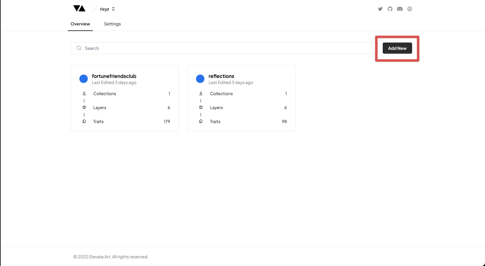
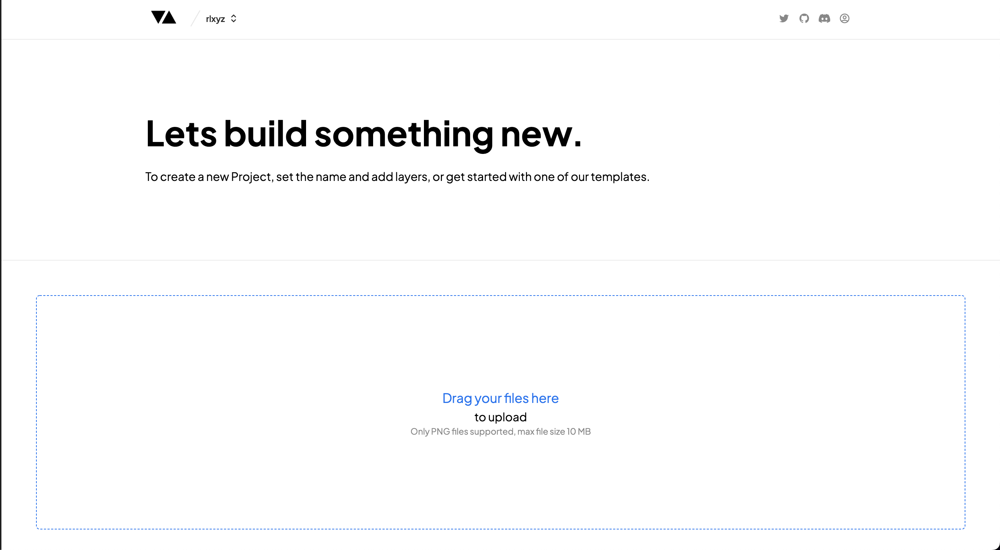
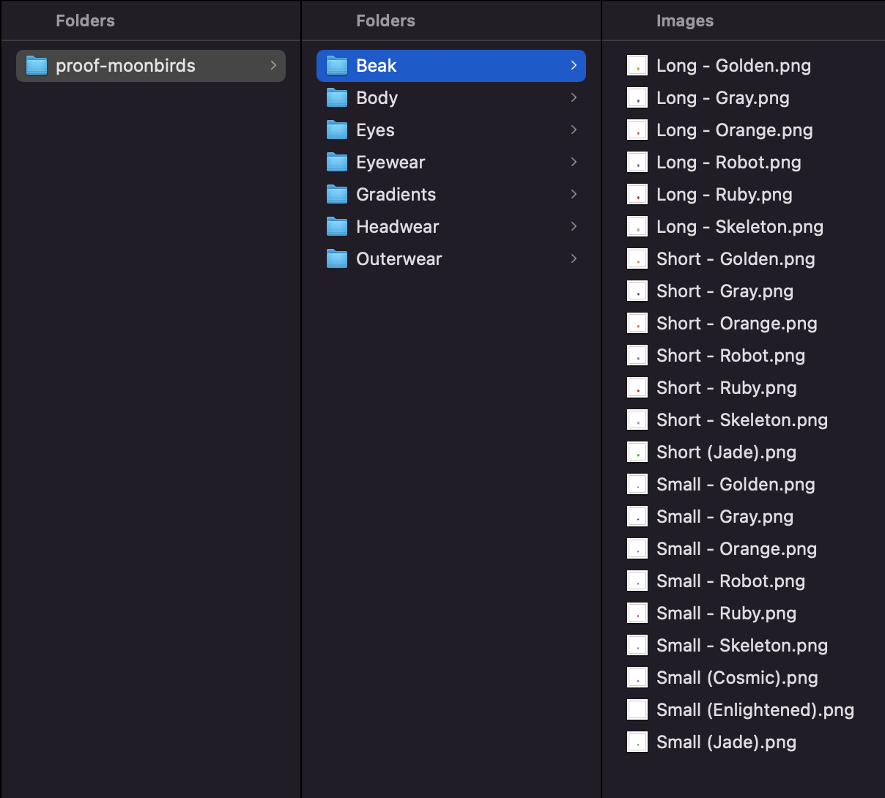
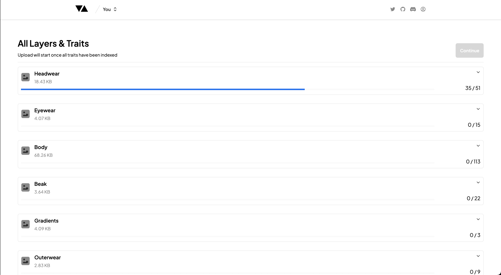
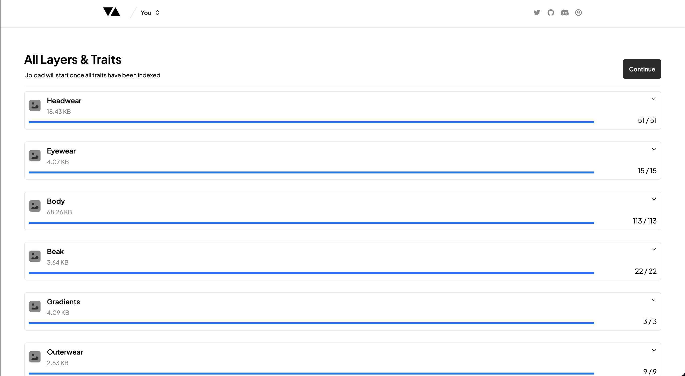

# Create a New Project

---

### Upload Your Art

Once you have created your Account or Team you will be able to create a new Project by clicking on the 'Add New' button.

### Upload File Structure

Once you are in the Upload page you will be able to drop in the parent folder with your Layer folders and Trait images placed in the file structure below. In the example below you will need to upload the 'proof-moonbirds' folder.

:::note
Uploading using the file structure below is important.
There is also a **20MB file size limit** and **accepted formats are '.png'**.

:::

Once you have dropped in your Parent Folder with all your Trait images inside it the upload will begin. You will be able to see the progress of the upload and depending on the size and number of the files you are uploading this could take a few minutes to complete.

:::note
Please be patient as your files upload and don't close down your tab until the upload is complete.

:::

Once all the files are uploaded you will be able to click through to Preview your Collection by clicking on the 'Continue' button.

🎉 **CONGRATULATIONS!** You've uploaded your first collection!
