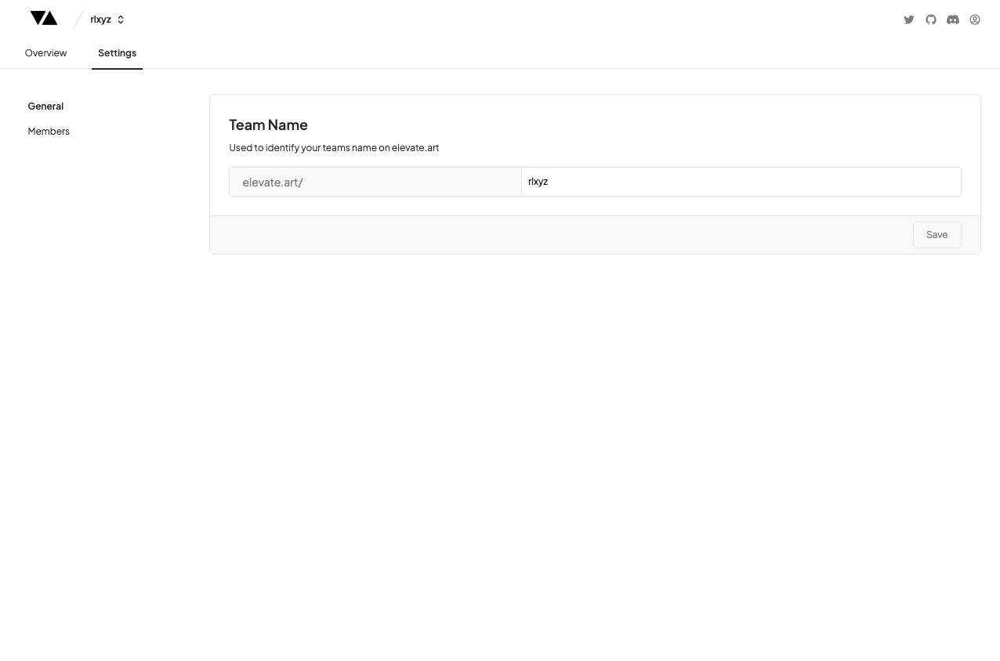
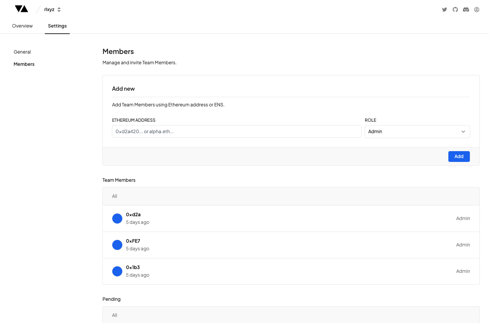

# Team Settings

---

### Rename Team

In the Settings tab in the General view you have the ability to rename your Team by typing in your new Team name and clicking the 'Save' button.

### Add Collaborators

You can add a new Collaborator to your Team by navigating to the Members section of the Team Settings.

Simply add a new Ethereum address which the new team member will use to Log in from (starts with 0x..) and choose the Role you'd like to assign them before clicking the 'Save' button.

### Current / Pending Team Members

You can see a list of all the existing Team Members and their roles, as well as all the Pending Team Invites in the tables below.

### Coming Soon

- Removing Team Members
- Changing Team Member roles
- Removing Team Invites
