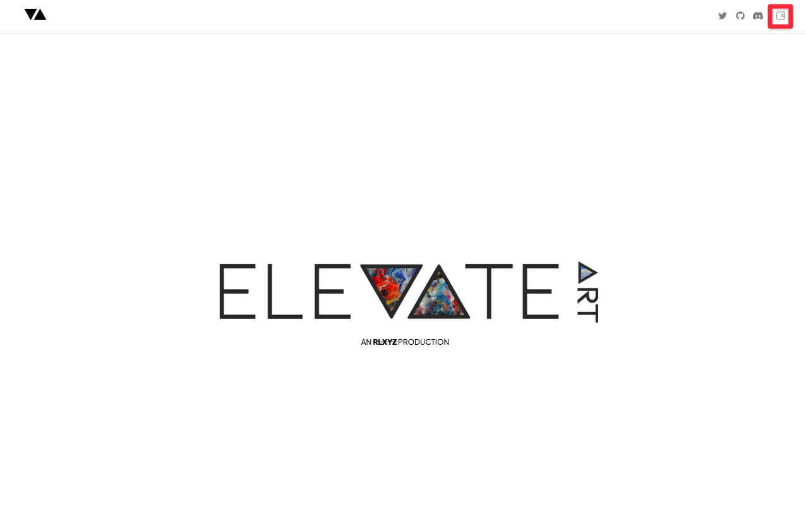
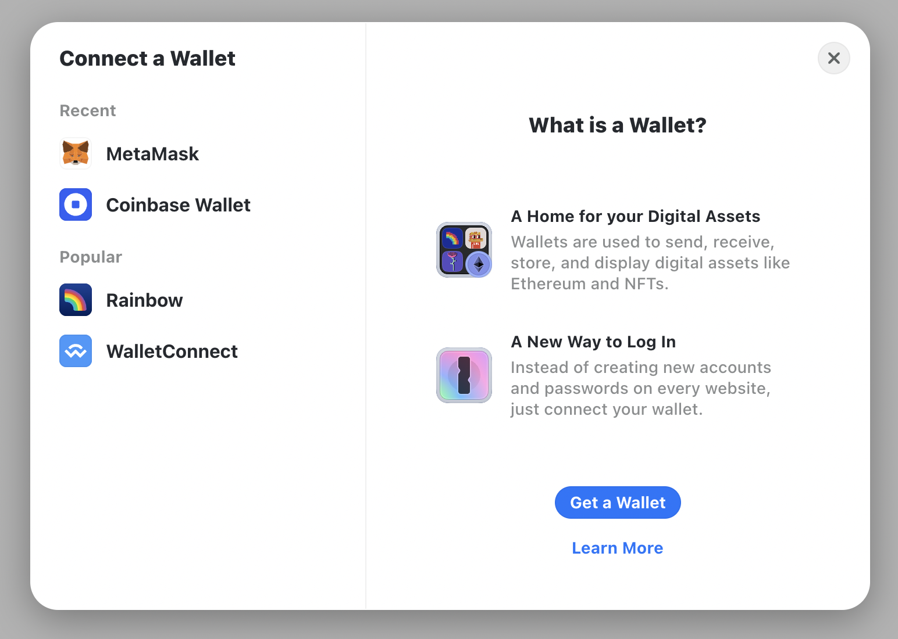
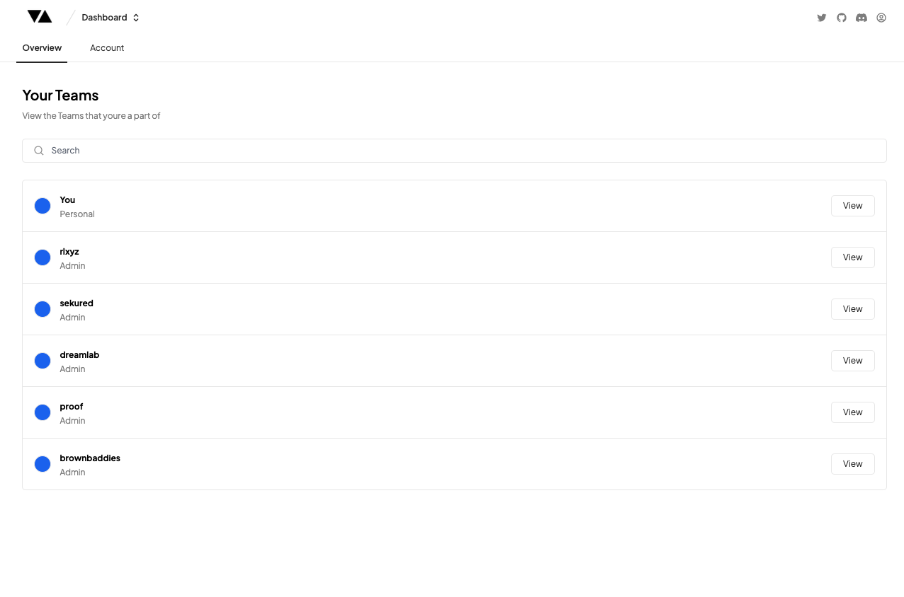

# Creating Your Account & Teams

---

### Connecting Your Wallet

Creating an Elevate Art account is super simple! Simply 'Sign Up' or 'Log In' by clicking on the Wallet in the top right hand corner.

You can use a MetaMask (recommended), Coinbase, Rainbow or WalletConnect supported wallet to log in. Click on your wallet of choice, then follow the prompts in the modal to connect your wallet to Elevate Art.

:::note
For Web3 it is standard practice to ‘Sign in’ using your Web3 Wallet as the primary authentication method for privacy as well as security.

The transaction that pops up to ‘Sign In’ is a _gasless_ (i.e. free) transaction which means you do not need any ETH in your wallet to complete this transaction. The _signing_ transaction is like a username/password log in that is there to confirm that you are the owner of that wallet.
:::

If you experience trouble logging in, double check to make sure you’ve downloaded any browser extensions required to connect, and if you have a popup blocker, make sure it is disabled for elevate.art.

---

### Create Your Team

Once you have logged in, you will land on your Dashboard page

be able to claim your _Team_ name and create a _Project_.

**Team**

The _Team_ name is your public facing profile page on _[elevate.art](http://elevate.art)_ which people will use when it comes time to mint. You will be able to see it here on the URL slug:

- elevate.art/**team**/project/

**Examples**

Depending on what kind of creator or organisation you are, here a few examples of the best ways to structure your _team_ naming convention.

**Artist**

This is an example of how artists XCOPY and Matt DesLauriers should name their team if they are working as a singular artist:

- elevate.art/xcopy/
- elevate.art/mattdesl/

**Organisations**
This is an example of how PROOF Holdings (founders of Moonbirds) or Yuga Labs (founders of Bored Ape Yacht Club) should name their respective teams "proof" and "yugalabs":

- elevate.art/proof/
- elevate.art/yugalabs/

:::note
For a design agency which is collaborating with multiple organisations or Web3 communities to create their generative collection we recommend creating a new _Team_ for each organisation or community you are working with.

:::

---

### Create Your Project

Once you have claimed your _Team_ name, you will be able to create a _Project_.

The _Project_ name is the public facing name of the generative collection you are creating on _Elevate_ which comes after the _Team_ slug:

- elevate.art/organisation/**project**/

**Examples**

Depending on what kind of creator or organisation you here are a few examples of the best ways to structure your _Team_ and _Project_ naming for future expansion.

**Artist**

This is an example of how XCOPY should name his 2 generative projects (Grifters and Max Pain):

- elevate.art/xcopy/grifters/
- elevate.art/xcopy/max-pain/

This is an example of how Matt DesLauriers should name his 3 generative collections (Subscapes, Meridians and Folio):

- elevate.art/mattdesl/subscapes/
- elevate.art/mattdesl/meridians/
- elevate.art/mattdesl/folio/

**Organisations**

This is an example of how Yuga Labs should name their 3 generative projects (Bored Ape Yacht Club, Mutant Ape Yacht Club and Bored Ape Kennel Club):

- elevate.art/yugalabs/bored-ape-yacht-club/
- elevate.art/yugalabs/mutant-ape-yacht-club/
- elevate.art/yugalabs/bored-ape-kennel-club/

This is an example of how PROOF Holdings should name their multiple generative projects:

- elevate.art/proof/moonbirds/
- elevate.art/proof/oddities/
- elevate.art/proof/mythics/
- elevate.art/proof/grails-1/
- elevate.art/proof/grails-2/

---

Congrats you've set up your _Team_ and _Project_!

Let's now move on to uploading your art to the [Generator](../docs/generator/intro)!
