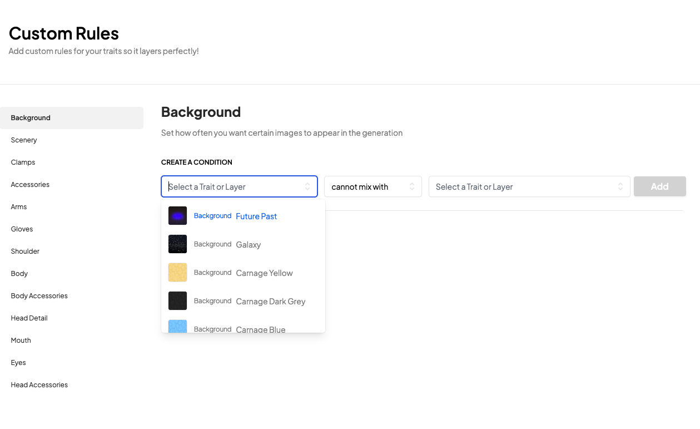
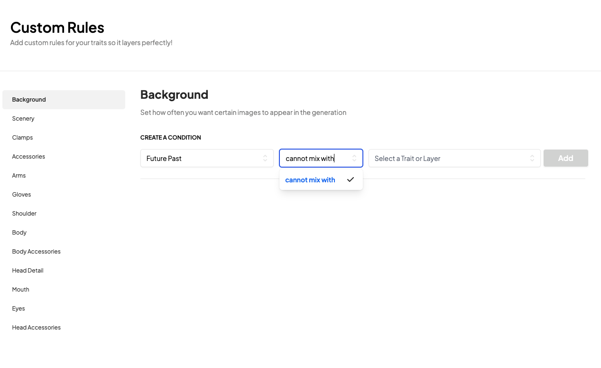
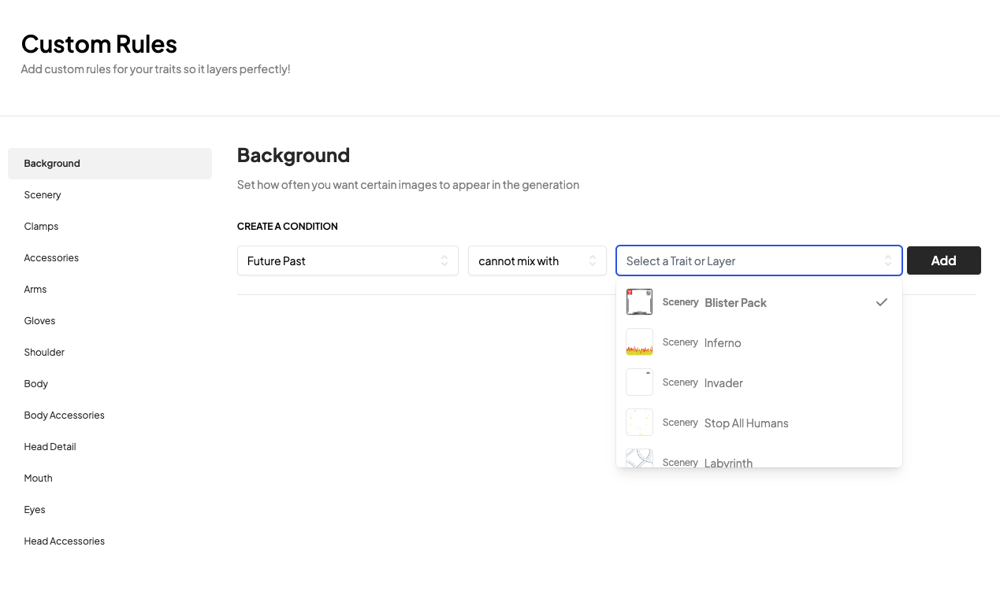
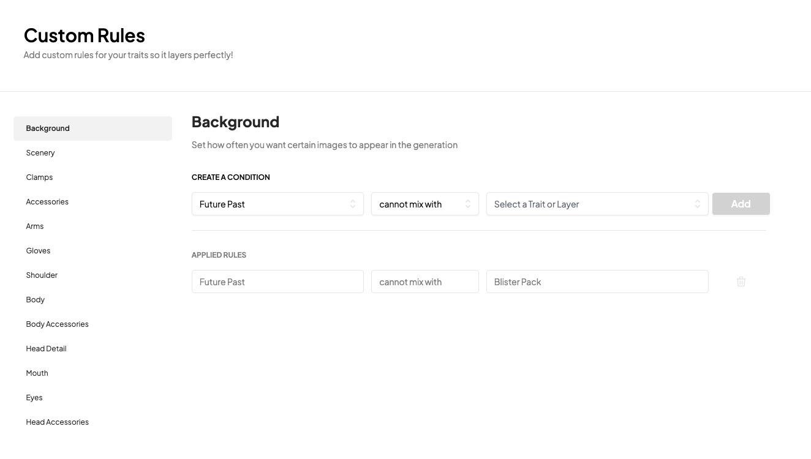

# Custom Rules

---

Rules is where the Elevate Generator really comes into its own. 

You can use the rules to refine how your collection will look by defining what you want to see and what you don't want to see.

### Creating Custom Rules
#### Step 1 - Select Trait you want to add a Rule toggle
You can add a rule to any trait in your collection and you can add as many rules as you want.

Traits are organised into the Layers so that you can see what rules apply to each layer.

#### Step 2 - Choose the Rule Type
You have several different options for rules which you can apply to a trait. These include the ability to ensure Traits:
• 'Cannot Mix With'   
• 'Only Mixes With'  
• 'Always Pairs With'   

Choose which rule works best for your use case.

#### Step 3 - Select the Trait you want to apply the rule to
You can select any trait in your collection to apply the rule to by typing or clicking on the dropdown to find the trait you want. You can select just one layer to apply the rule to or multiple layers.

Once you have selected all the relevant fields the 'Add' button will become active for you to add your new Rule.

#### Step 4 - View your new Rule
Congrats! You've created your first rule! You can see your new rule in the 'Applied Rules' section of the Custom Rules section. The rules are bi-directional so if you have a rule that says 'Cannot Mix With' then the trait you have selected will also have a rule that says 'Cannot Mix With' the trait you have selected. That way you know all the Rules that have been applied to your Layer. 

