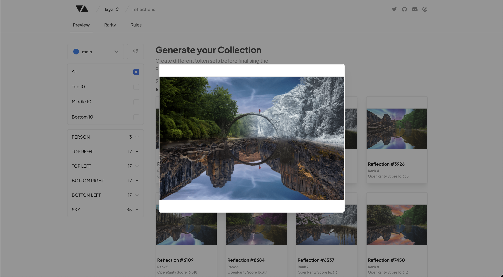

# Expand Image

---

### Expanded View of a Token

Clicking on any of the images that have been generated will expand the image for you to have a closer look.

:::note
When looking closer at your layers it's important to look for any layers that don't quite line up correctly, or any traits that do not work well together. You can then adjust the Traits by replacing existing layers and/or adjusting the layer rules in the [Rarity](./rarity) tab.
:::

### Coming Soon

- View each individual tokens metadata and rarity
- Adjust layers inside the expanded view
