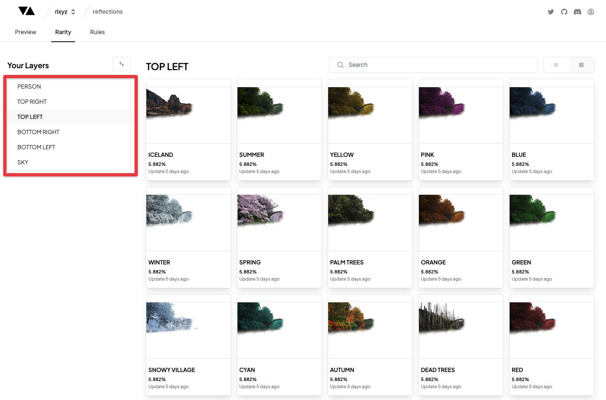
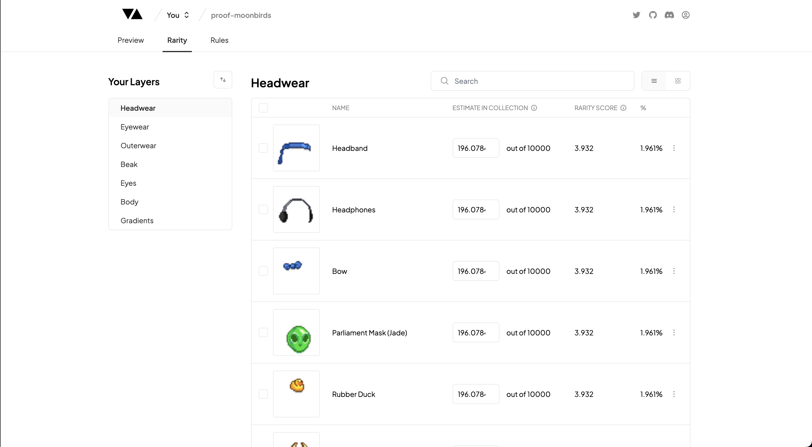
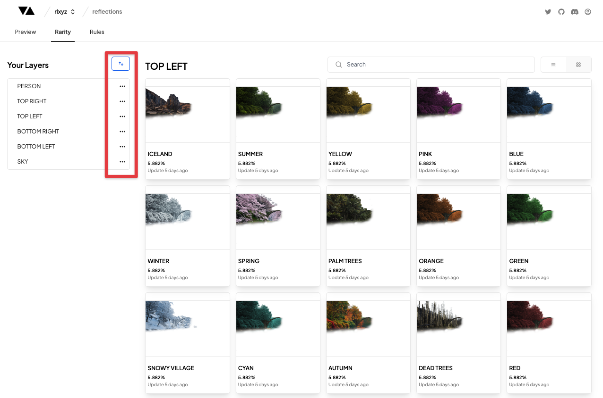

# Layers

---

### Layers Section

The Layers section of the Rarity view is a navigation section where you can see all your existing Layers and navigate to the individual Traits that are currently in your project.

### Reordering Layers

You can re-order the layers in your project by clicking on the 'Re-Order Layers' button highlighted in the image above.

Once you have clicked the 'Re-Order Layers' button each Layer will have an icon displayed which you can use to drag any Layer up or down in the list of Layers.

This will change the order in which the Layers are rendered in your project.

:::note
The Layer at the bottom of the Layer Table is the furthest Layer back (the 'Background') in the compiled image, with the Layer at the top of the Layer Table being the closest Layer in the compiled image.
:::

### Coming Soon

- Adding a Layer
- Deleting a Layer
- Editing Layer Properties
