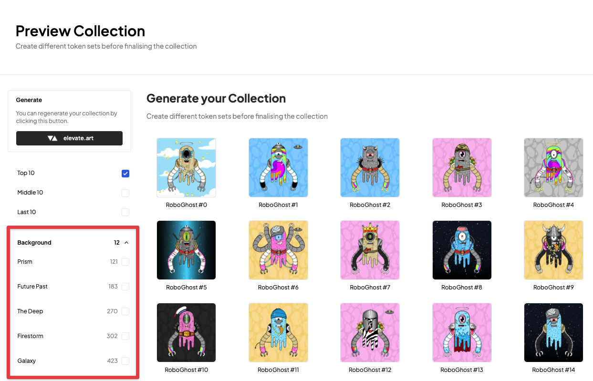
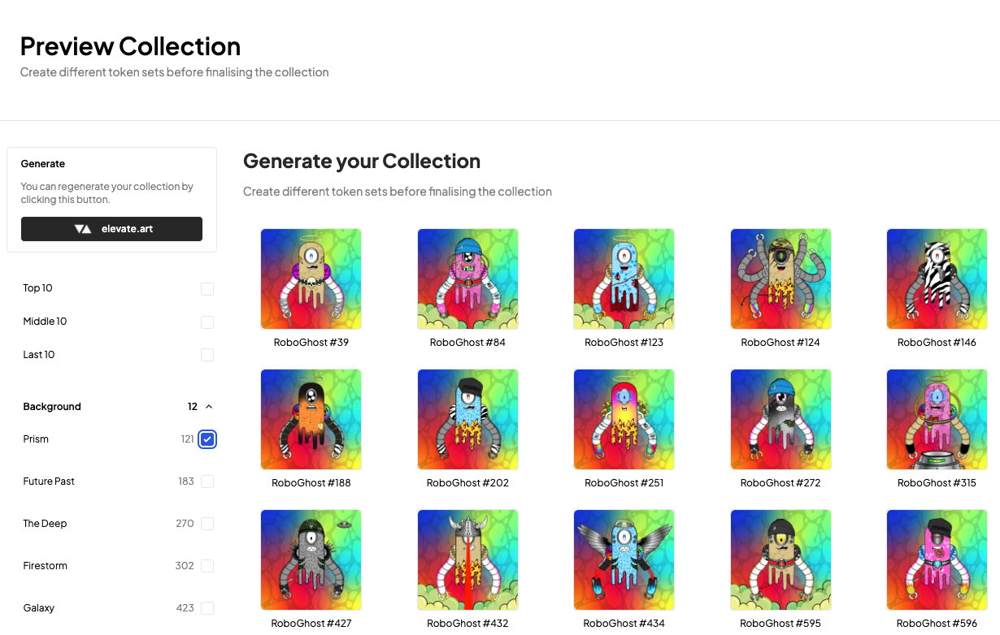
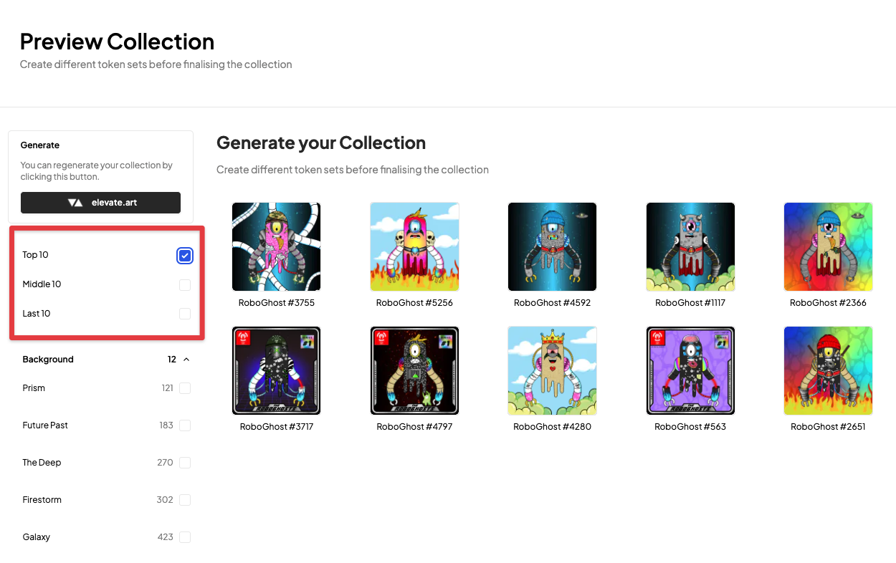
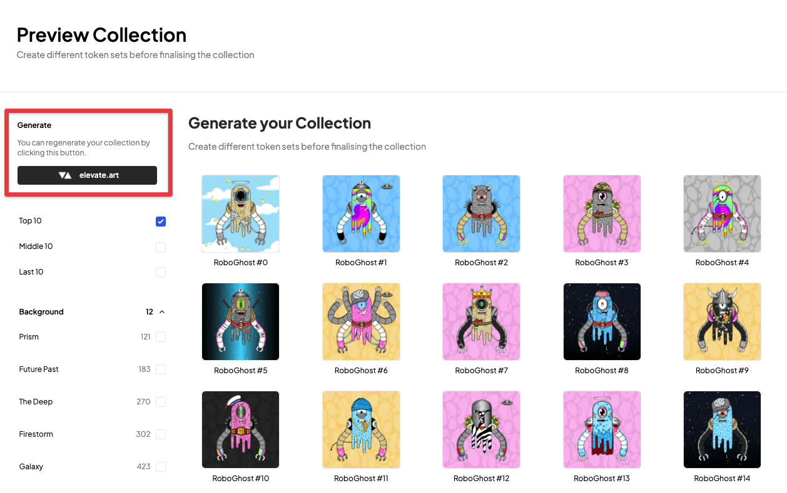

# Preview Collection

---

Once you have successfully uploaded your art layers the *Elevate* Generator will automatically create a preview collection for you. This collection will match the collection size you specified earlier. 

Here you'll have the ability to scroll through your entire collection and see how your art layers look as a complete collection. You may find that on the first pass you need to make some adjustments to your art layers. This is a great way to see how your collection will look before you export it.

---
### Filtering

Filtering is a key feature of the Preview feature of the Generator as it gives you an easy way to see how your entire colleciton is broken down in terms of traits. You can filter by trait, rarity, or even by the number of traits an NFT has.

The filter system is very flexible and allows you to filter by multiple traits at once. For example, you can filter by all of the traits in a collection, or you can filter by a single trait. You can also filter by multiple traits at once.

The filter system also follows how it will be displayed in the leading market places. You can expand each layer to see the traits that make up that layer. You can also see the rarity of each trait and the number of times it appears in the collection.

---
### Top / Middle / Bottom 10 Rarity

As a collector one of the key quality filters that will be used over a collection is how good the art is not just at the top tier of rarity but also at the 'floor' (bottom) rarity. 

If you have a collection that is visually indistinguishable from the most rare to the least rare, then all things being equal, it will not be as valuable.

To make it easier for you to view this at a glance we have created a filter to give you the ability to filter by the top, middle, and bottom 10% of rarity. This is a great way to get a quick feel for how the overall look of the entire collection will be.

---
### Generate a new collection

One of the major advantages of using *Elevate* is that we have optimised the Generator to the point where you can generate a new collection in seconds. We want to make sure that your ability to generate new collections is as fast as possible and that you can generate as many collections as you want at no cost. 

You will find the 'Evelvate.Art' button above the filters on the left hand sidepanel of the Generator. Clicking this will generate a new collection for you.

### Coming soon
• Expand individual tokens with ability to edit traits  
• Re-roll individual tokens

