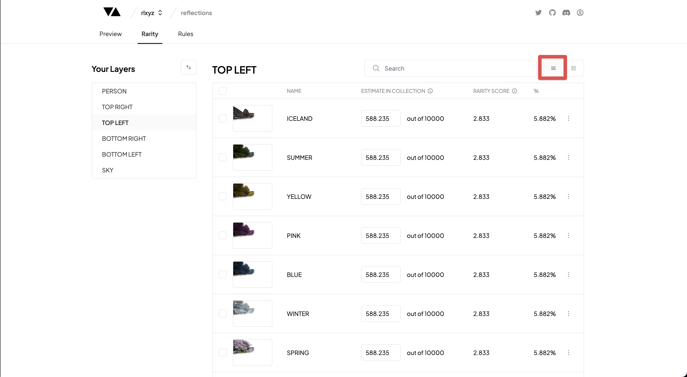

# Rarity Table

---

### Rarity Table

The Rarity table is one of the fundamental sections for refining the look and distribution of traits within your collection.

This is the default view when you click on the Rarity tab and you can navigate to this page by clicking on the table view highlighted in the image above.

The Traits in the Rarity Table is ordered from rarest to most common in each Layer with a few Trait details:
• Trait Image
• Trait Name  
• Estimated Quantity (out of total supply)  
• Rarity Score based on the OpenRarity Standard (higher number means a rarer trait)
• Estimated % of Total Supply

Each Layer also has a 'None' Trait, which can be used to specify how rare you would like the overall trait to be amongst the collection.

:::note
If you would like a particular layer to only be present in 30% of the collection, you would specify the 'None' Layer to be 70% of that layer. The remaining Traits would then be distributed amongst the remaining 30% of the collection.
:::

### Adjusting Rarity

You can adjust the rarity of a Trait by either typing a new number into the 'Estimate in Collection' section or incrementing or decrementing the toggle. When uploading your first collection the traits will default to an equal distribution amongst all Traits.

When changing one of the Trait rarities in the Rarity Table all the other Traits will be distributed linearly across all the other Traits based on their existing distribution.

:::note
EXAMPLE: If you have 5 layers and a total collection supply of 100 which were equally distributed (20 each), and you adjust one layer to 12. The displaced 8 will be equally distributed amongst the other 4 layers equally (changing the remaining layers from 20 to 22 each).
:::

The only exception to the above is when you have a Trait with 'Estimate in Collection' of 0, in which case the displaced number of traits will ignore that Trait when distributing equally.

### Search

You can search the Traits in your Layers by entering your search term into the Search bar at the top of the Rarity Table.

### Coming Soon

- Renaming Traits
- Deleting Traits
