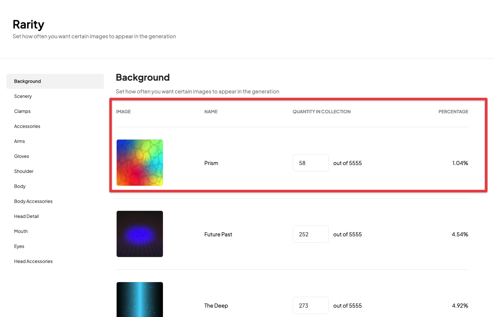
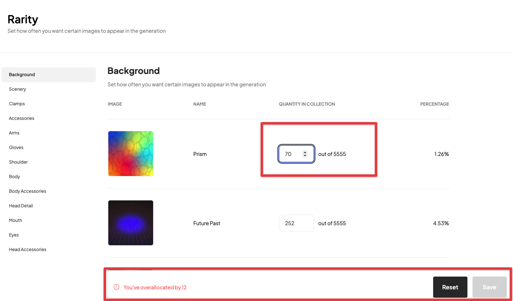

# Rarity

---

The Rarity section of the Generator is where you have the ability to refine the rarity of the existing collection that has been created in the Preview section. 

### Rarity View
Traits are ordered from rarest to most common in each Layer that you have in your project along with a few Trait details:
• Trait Image  
• Trait Name  
• Quantity (out of total supply)  
• % of Total Supply  

### Adjusting Rarity
You can adjust the rarity of a Trait by either typing a new number into the Trait Quantity section or incrementing or decrementing the toggle. 

The Generator is smart in that it will tell you when you have to adjust the rarity of another Trait based on the changes you made in another layer so that the total layer quantity sums to the total collection size and will not allow you to save until you have made the necessary adjustments.

